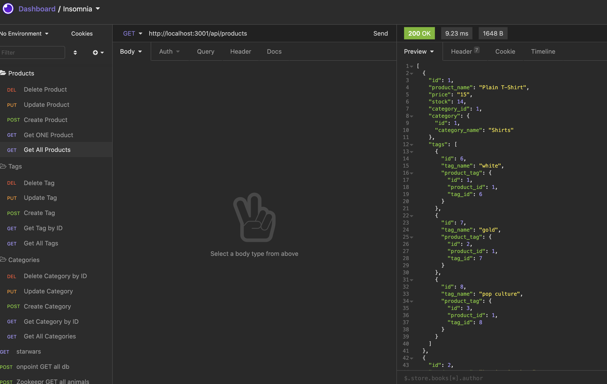

# easy-e-commerce-backend
## by Aaron Rosenblatt

### I wrote code to build the back end for an e-commerce site. I took a working Express.js API and configured it using Sequelize to interact with a MySQL database. This app uses an environmental variable file to add the database name, MySQL username and MySQL password. Once the user connects to the database using Sequelize, schema and seed commands should be entered and and a development database is created and seeded with test data. When the user starts the application the server starts and the Sequelize models are synced to the MySQL database. Using Insomnia Core for categories, product or tag API GET routes, the data for each route will be displayed in a formatted JSON. When the API POST, PUT and DELETE routes are tested in Insomnia Core, data will be created, updated and deleted in the database.

### The database models include Category, Product with a reference to the Category model's id, Tag, and ProductTag with a reference to the product model's id and the tag model's id. In addition to completing the API routes to perform RESTful CRUD operations, I executed the association methods to create relationships between: Product belongs to Category, Category has many Product models, Product belongs to many Tag models, and Tag belongs to many Product models. 

#### To use Easy E-Commerce Backend, clone the [app](https://github.com/noplur/easy-e-commerce-backend), use Terminal to go to the Easy E-Commerce Backend's root directory. Navigate to the MySQL shell and type "mysql -u root -p". Enter the prompt for your password and execute the following command: "source db/schema.sql". Typing in "show databases" should ensure the database was created. Then enter "quit", "npm run seed" and "npm start". From there the API routes can be carried out through Insomnia Core.

### The Easy E-Commerce Backend walk-through video can be viewed here: https://drive.google.com/file/d/11Wv3wtgieue3e2xZlY02wTh8k0L9qfWZ/view

### The GitHub repository for the Easy E-Commerce Backend can be viewed here: https://github.com/noplur/easy-e-commerce-backend

### Here is a screenshot of a sample from Easy E-Commerce Backend:
### 